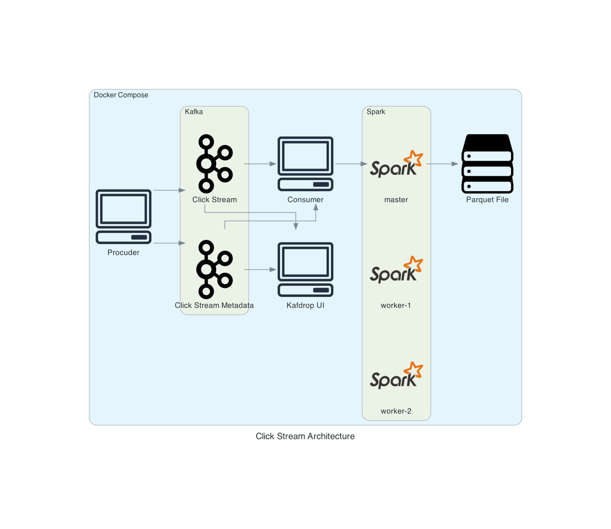
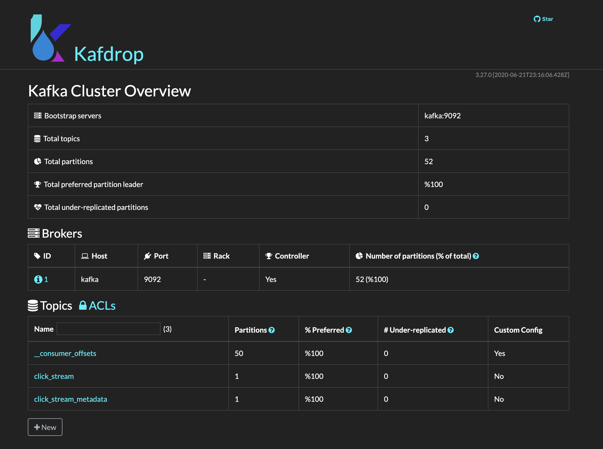
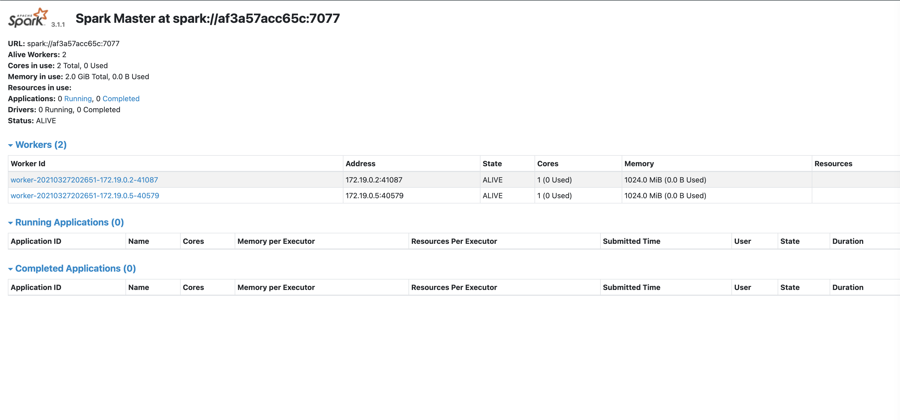

# Click Stream Data Flow
The Project is clickstream data flow using kafka, spark, and parquet.
## Architecture Approach
- Data directory includes clickstream data as clickstream and clickstream metadata.
- Example data in the data directory. This project supports multiple files. only data files should be same prefix for the naming.
  *PRODUCER_CLICK_CSV_DATA_PREFIX* and *PRODUCER_CLICK_METADATA_CSV_DATA_PREFIX* environment variables using for finding files and categorize data.
- 2 topics in the kafka as clickstream and clickstream metadata.
- Procuder application sends clickstream and clickstream metadata to different 2 topics
- Consumer application read clickstream and clickstream metadata from 2 kafka topics with pyspark.
- | MISSING | Consumer application aggregates data from clickstream and clickstream metadata.
- | MISSING | Aggregated data on Consumer application writes to hive
- Consumer application writes to apache parquet.


### Environment Variables

```dotenv
PYTHONPATH=. # 
KAFKA_TOPIC=click_stream # Using for click_stream data topic name
KAFKA_METADATA_TOPIC=click_stream_metadata # Using for click_stream metadata data topic name
KAFKA_CONSUMER_GROUP=demo # Kafka consumer grouping name
KAFKA_SERVERS=kafka:9092 # Kafka consumer and producer connection path for docker consumer

PRODUCER_CLICK_CSV_DATA_PREFIX=clicks_hour_ # Producer application uses for finding clickstream data in the data directory for feeding Kafka topic
PRODUCER_CLICK_METADATA_CSV_DATA_PREFIX=articles_metadata # Producer application uses for finding clickstream metadata data in the data directory for feeding Kafka topic
PRODUCER_DATA_ROOT_DIRECTORY=app/data # Producer application data directory
PRODUCER_DOCKER_INITIALIZE_WAIT_TIME=120  # Producer application waiting time for docker initialing
PRODUCER_ITEM_WAIT_TIME=0 # Waiting time for the feed subject of the manufacturer application.
PARENT_DIRECTORY_PREFIX=../ # Producer service in the sub directory and the env variable using for go to parent directory
CSV_SUFFIX=.csv # Producer data suffix

SPARK_SERVER_HOST=spark # consumer spark host for spark connection on docker compose

PARQUET_DESTINATION_PATH=. # parquet extarct path. on the root
CHECK_POINT_LOCATION=. # parquet check point path. on the root
```


### To build it:
```sh
docker-compose up --build
```

### List of Kafka topics on Kafka container
```sh
./opt/kafka_2.13-2.7.0/bin/kafka-topics.sh --list --zookeeper zookeeper:2181
```

### Kafka stream data on Kafka container
```sh
./opt/kafka_2.13-2.7.0/bin/kafka-console-consumer.sh --bootstrap-server localhost:9092 --topic click_stream --from-beginning
```

### Kafka UI with kafdrop
```sh
http://localhost:9000/
```


### Spark Master UI
```sh
http://localhost:9000/
```

